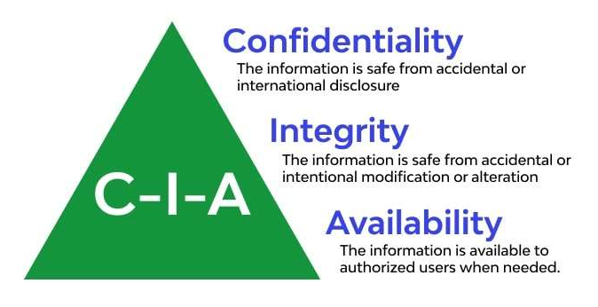
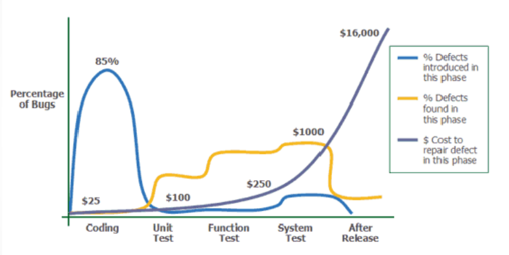
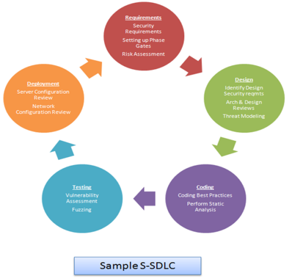

# Lecture 01

## What is Software Security?
- Protection of software from unauthorized access, use, modification, or destruction.
- Goal: Ensure confidentiality, integrity, and availability (CIA triad).

## Key Principles of Software Security

## Why is Software Security important?

1. Growing dependency on software in critical systems.
2. Increase in cyberattacks exploiting vulnerabilities.
3. Real-world impacts: data breaches, financial losses, damaged reputation.

## What are the Key Challenges in Software Security

1. Rapid DevOps/Agile cycles.
2. Complex software ecosystems.
3. Limited awareness and training.
4. Insider threats.

## Common Threats in Software Security

1. Malware: Viruses, ransomware, spyware.
    - Viruses attach themselves to programs and spread when executed.
    - Ransomware locks or encrypts files, demanding payment to restore access.
    - Spyware secretly monitors user activity and steals sensitive information.

2. Phishing/Social Engineering.
    - trick people into revealing personal or confidential information by pretending to be trustworthy entities (like banks or colleagues).

3. Vulnerability Exploits: SQL injection, buffer overflows.
    - Attackers take advantage of weaknesses in software code.

4. Supply Chain Attacks:
    - Hackers target a trusted third party (like a software vendor or update server) to compromise many users at once.
    - Example: The SolarWinds attack, where hackers inserted malware into a legitimate software update.

## Common OWASP 10 Vulnerabilities

1. Injection (SQL, command, etc.)
2. Broken Authentication
3. Sensitive Data Exposure
4. Security Misconfiguration
5. Cross-Site Scripting (XSS)

## Software Security vs. Application Security

| Aspect   | Software Security            | Application Security     |
| -------- | ---------------------------- | ------------------------ |
| Approach | Preventive                   | Reactive                 |
| Focus    | Build security in            | Patch after deployment   |
| Scope    | OS, Middleware, Applications | Application only         |
| Strategy | Holistic & long-term         | Issue-based & short-term |

## Practices in Application Security

- Annual penetration tests and vulnerability assessments.
- Focus often on compliance rather than prevention.
- Vulnerability Assessment: Identify and quantify vulnerabilities.
- Penetration Testing: Simulate real-world attacks.

## Impact of Security Breaches

- Financial loss
- Reputation damage
- Legal issues & lawsuits
- Regulatory fines (e.g., GDPR)
- National security risks

## Cost of fixing bugs

- Cost increases drastically when bugs are found later in the SDLC.
- Fixing early is cheaper and reduces operational vulnerabilities.

## Why Application Security Alone Isn’t Enough

- Costly patch management.
- 0-day vulnerabilities remain unpatched.
- Patches may not fix the root cause.
- Firewalls/IDSs can’t stop all threats.

| 👉 Solution: Build security into the development process (built security inn).

## Secure Software Definition

- Reliable software does what it’s supposed to do. Secure software does that and nothing else.

## Secure Software Development Lifecycle (S-SDLC)

- Security integrated in every phase of SDLC
    
    

- How to implementing S-SDLC

    - Establish security policies.
    - Get support from all stakeholders.
    - Implement incident response plans.
    - Train users and developers.
    - Clients can demand security via SLAs.

## Threat Modeling Basics

- Definition: Identify and prioritize potential threats.
- Frameworks: STRIDE, DREAD.
- Example: Threats in a banking application.

## Secure Coding Best Practices

- Don’t hardcode credentials.
- Validate all input data.
- Use parameterized queries (prevent SQL injection).
- Keep dependencies updated.
- Vulnerability Management
    - Use scanning tools: Nessus, OWASP ZAP.
    - Maintain patch management policies.
    - Conduct regular security audits.

## Security Testing Types

1. SAST: Static Application Security Testing.
2. DAST: Dynamic Application Security Testing.
3. IAST: Interactive Application Security Testing.
4. Mix automated and manual testing.

## Aspects of Software Security

- Code Level Security, User Input Verification
- OS and language differences.
- Cryptography.
- Access control.
- Data-at-rest and data-in-transit protection (e.g., TLS/SSL).
- Penetration testing and vulnerability assessments.

## Emerging Trends in Software Security

- Zero Trust Architecture (ZTA).
- Security in AI-driven applications.
- Post-quantum cryptography.

## Real-World Security Breaches

- SolarWinds supply chain attack.
- Equifax data breach.
- WannaCry ransomware attack.

## Runtime Application Security

- Runtime Application Self-Protection (RASP): Real-time protection against attacks.
- Memory protection (ASLR - Address Space Layout Randomization, DEP - Data Execution Prevention).
- Sandboxing and container security.

## Regulatory and Compliance Requirements

- GDPR: Data protection (EU).
- HIPAA: Healthcare data.

