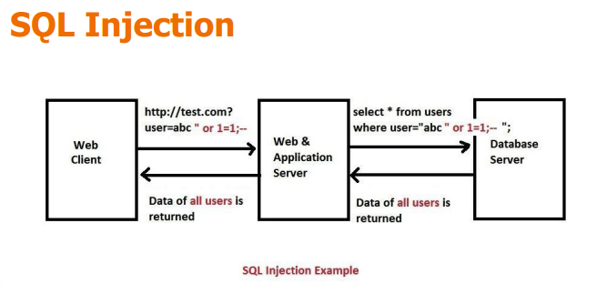
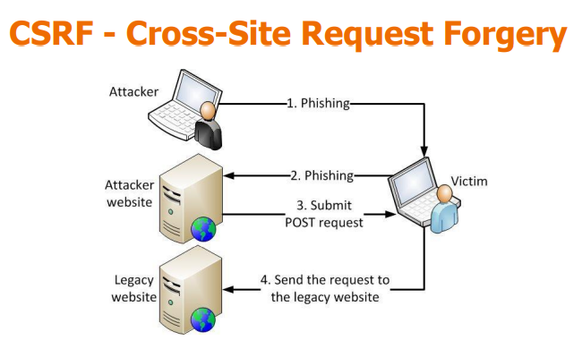
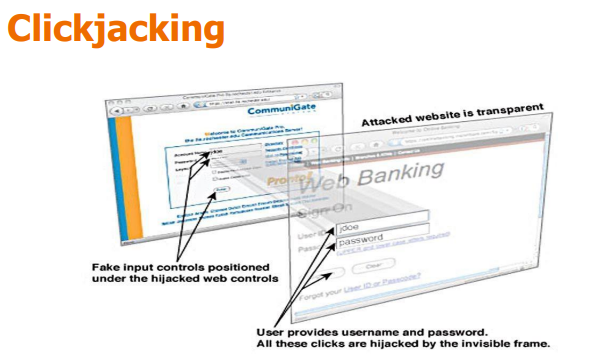
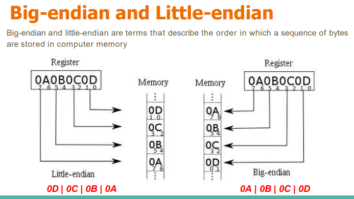

# LEcture 11

## Common Web Application Issues

-   Injection Attacks: Occur when untrusted data is inserted into code or commands (e.g., SQL Injection).

-   Cross-Site Scripting (XSS): Injects malicious scripts into web pages.

-   CSRF (Cross-Site Request Forgery): Tricks a logged-in user into performing unwanted actions.

-   Clickjacking: Deceptive UI tricking users into clicking hidden buttons.

-   Unvalidated Redirects: Redirecting users to untrusted external pages.

## SQL Injection

## CSRF

## Insecure Deserialization

-   Insecure deserialization is a vulnerability that occurs when untrusted data is deserialized (converted back into objects) without proper validation, allowing attackers to craft payloads that cause unexpected behavior — from logic abuse and data tampering to remote code execution (RCE).

## Clickjacking

## Buffer Overflow

-   A buffer overflow occurs when a program writes more data to a buffer than it can hold, overwriting adjacent memory locations.

-   Timeline of Major Exploits

    -   1972: Concept first documented.
    -   1988 Morris Worm: Used unchecked buffers in gets() function.
    -   2001 Code Red Worm: Targeted Microsoft IIS 5.0.
    -   2003 SQL Slammer: Attacked Microsoft SQL Server 2000.
    -   Gaming Consoles: PS2 Independence Exploit, Wii Twilight Hack used buffer overflows to bypass software restrictions.

-   How it works:

    -   When input exceeds allocated memory space:

        -   Adjacent variables or control data (like return addresses) get overwritten.

        -   May lead to program crash (segmentation fault) or arbitrary code execution.

-   Detection: Operating systems may detect illegal memory writes and raise a segmentation fault to stop the program.

-   Damage
    -   Causes denial of service (DoS).
    -   Can be escalated to remote code execution (RCE).

Memory Structure Concepts

-   Big-Endian vs Little-Endian

    -   Big-endian: Most significant byte stored first.
    -   Little-endian: Least significant byte stored first.

    

-   Registers
    -   High-speed storage units within the CPU used for:
        -   Data registers
        -   Segment registers
        -   Index registers
        -   Control registers

Stack Frame and Stack Overflow

-   Each function call creates a stack frame containing:
    -   Local variables
    -   Return address
    -   Function parameters

Stack Buffer Overflow (Stack Smashing)

-   Occurs when a buffer on the stack is overwritten.

-   Exploitation Methods:

    -   Overwriting local variables.
    -   Overwriting the return address so execution jumps to attacker code.
    -   Overwriting function pointers or exception handlers.

-   Heap Overflow

    -   Different from stack overflow — targets heap memory, which is dynamically allocated at runtime.

-   Exploitation:

    -   Corrupts internal heap structures (like linked list pointers or metadata).
    -   Overwrites function pointers or memory allocation metadata to redirect execution.

-   Canonical Technique:

    -   Overwriting malloc metadata to manipulate subsequent allocations.

-   Read Overflow (Information Leakage)

    -   Occurs when reading beyond buffer limits, exposing sensitive data.
    -   Example: Heartbleed Bug (2014)

-   Countermeasures

    -   Libsafe Project: Re-implements unsafe C functions like strcpy, strcat, gets with safe versions.

    -   StackGuard: Compiler-level defense that inserts “canary” values before return pointers; detects modification before returning.

    -   Bounds Checking: Ensures data fits within allocated buffer.

    -   DEP & ASLR: Modern OS-level protections: prevent code execution in data memory regions and randomize memory layout.

-   Remote Code Execution (RCE)

    -   Occurs when an attacker successfully runs arbitrary code on a target system, often using buffer overflows or injection flaws.

-   Impact:
    -   Full system compromise.
    -   Malware installation.
    -   Data theft or ransomware delivery.
