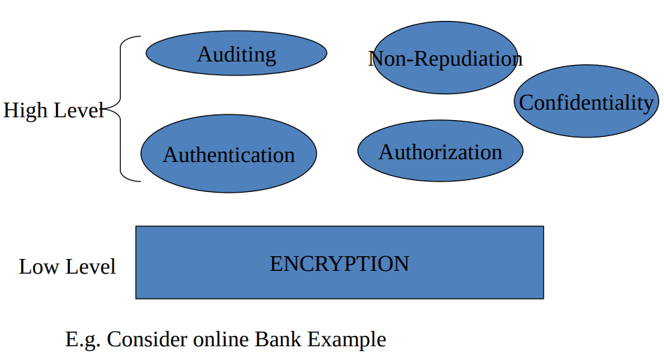
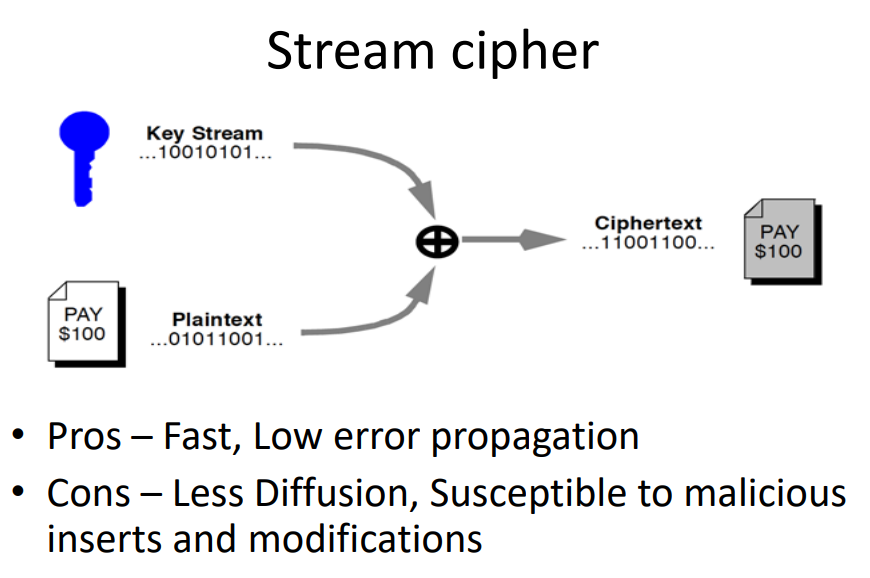
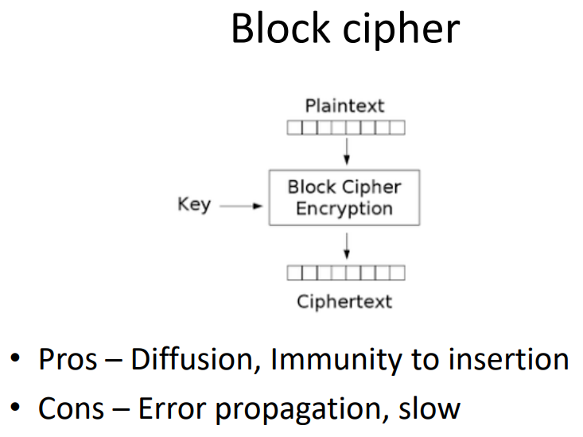

# Lecture 02 (Introduction to Cryptography)

## Security requirements

## What is Cryptography?

- Goal: keep information from those who aren’t supposed to see it

## Security Requirements in Cryptography

- Confidentiality: Data should only be visible to authorized users.

- Integrity: Data must not be altered during transmission.

- Authentication: Verifying the identity of users or systems.

- Authorization: Determining access rights to resources.

- Auditing: Tracking actions for accountability.

- Non-repudiation: Ensures that a sender cannot deny sending a message.

## Key Definitions

- Cryptography: Protecting data through encoding.

- Cryptanalysis: Breaking ciphertext without knowing the key.

- Cryptology: The study of both cryptography and cryptanalysis.

## How Cryptography Works

- Uses a well-known encryption algorithm that takes two inputs:

    - Data (plaintext)
    - Key

- The algorithm scrambles data into ciphertext.
- Only users with the correct key can decrypt it back to plaintext.

## Characteristics of a good cipher

1. Confusion – Interceptor should not be able to predict how changing one character in plaintext will change the ciphertext.

2. Diffusion – The characteristic of distributing the plaintext over the entire ciphertext

## Types of Ciphers

### Stream Cipher

- Encrypts data one bit/byte at a time.

- Pros: Fast, low error propagation.

- Cons: Less diffusion, more vulnerable to modifications.

    

### Block Cipher

- Encrypts fixed-size blocks of data (e.g., 64 or 128 bits).

- Pros: High diffusion, immune to insertion attacks.

- Cons: Slower, higher error propagation.
    
    

## Types of Security

- Unconditional security: Cannot be broken, regardless of computational power. (e.g., One-Time Pad)

- Computational Security: Can theoretically be broken, but would take an impractical amount of time and computing power. (e.g., AES, RSA)

## Brute Force Attack

- An attacker systematically tries all possible keys until the correct one is found.

- Mitigation: Use long, complex keys to make brute-force infeasible.

## Cryptography Basics

- Encryption converts plaintext → ciphertext using key KE.

- Decryption converts ciphertext → plaintext using key KD.

- Algorithms are public, but keys must remain private.

## Cryptographic Terminology

- Plaintext: Original readable message.

- Ciphertext: Encrypted, unreadable message.

- Key: Information needed for encryption/decryption.

- Cipher/Function: The encryption algorithm itself.

- Key Distribution: Method of securely sharing keys between parties.

## Symmetric Key Encryption

- Both sender and receiver share the same secret key for encryption and decryption.

- Example: DES (Data Encryption Standard)

    - Uses 56-bit key.

    - Works through multiple rounds of substitution and permutation.

- Pros:

    - Fast and efficient.

- Cons:

    - Key management is difficult (scales poorly with more users).

    - Key distribution must be secure.

    - Provides confidentiality only (no authentication or non-repudiation).

## Asymmetric (Public Key) Encryption

- Uses two mathematically related keys:

    1. Public key: Shared openly.

    2. Private key: Kept secret.

- Encryption with public key → Decryption with private key.

- No need for secure key sharing.

- Pros

    - Solves key distribution problem.

- Cons

    - Slower compared to symmetric encryption.

- Applications of Asymmetric Encryption

    - Authentication: Verify identity of sender.

    - Confidentiality: Protect message contents.

    - Non-repudiation: Sender cannot deny sending a message.

## Pretty Good Privacy (PGP)

- A hybrid system combining both symmetric and asymmetric cryptography:

    - Uses asymmetric encryption to exchange symmetric session keys.

    - Uses symmetric encryption for the actual data transfer (faster).

    - Used in emails and file encryption.

## Hash Functions

- A hash function generates a fixed-size digest from variable-length input data.

- Properties:

    - One-way (cannot retrieve original input).

    - Produces unique output for each input.

    - Deterministic (same input → same hash).

- Examples: MD5, SHA-1, SHA-256, SHA-512.

- Salted Hashing

    - Adds a random value (“salt”) to passwords before hashing to prevent dictionary and rainbow table attacks.

## Hash Collisions

- Occurs when two different inputs produce the same hash output.

- Example: First SHA-1 collision (2017) — demonstrated vulnerability.

## Rainbow Tables

- Precomputed tables used to reverse cryptographic hash functions.

- Used in password cracking — mitigated by salting.

## Applications of Hashing

- Password protection (store hashes instead of plain passwords).

- Data integrity (e.g., digital signatures, software updates).

- Blockchain verification (linking blocks securely).

## Quantum Cryptography

- Quantum computers can break classical algorithms like RSA.

- Quantum cryptography uses quantum mechanics (e.g., quantum key distribution) to build systems resistant to such attacks.

## Summary

- Cryptography ensures confidentiality, integrity, and authentication.

- Symmetric encryption: Fast, shared secret key.

- Asymmetric encryption: Slower but solves key distribution.

- Hashing: Protects data integrity and passwords.

- Quantum cryptography: The future of secure communication.

