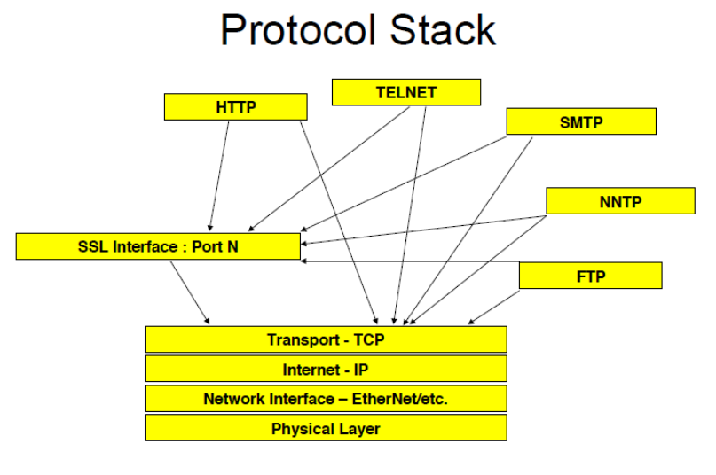
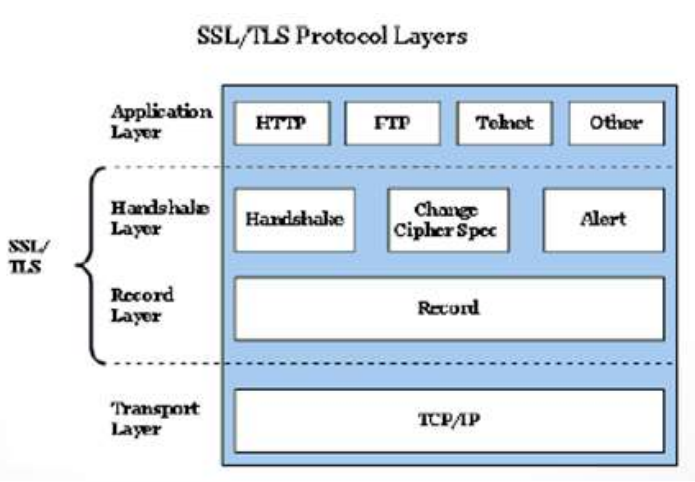
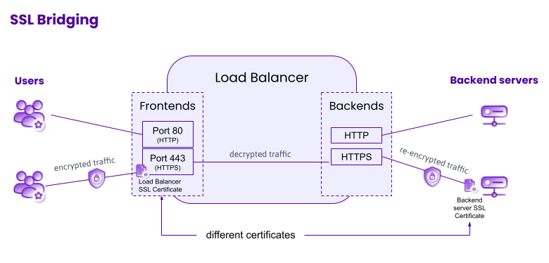
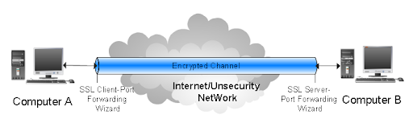
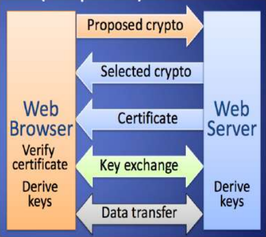
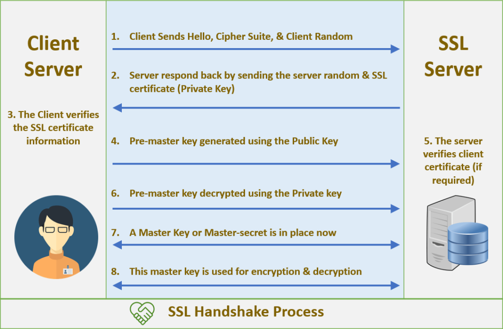
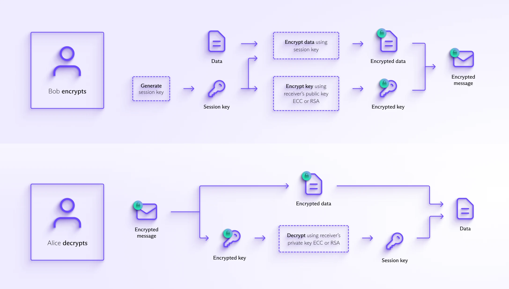
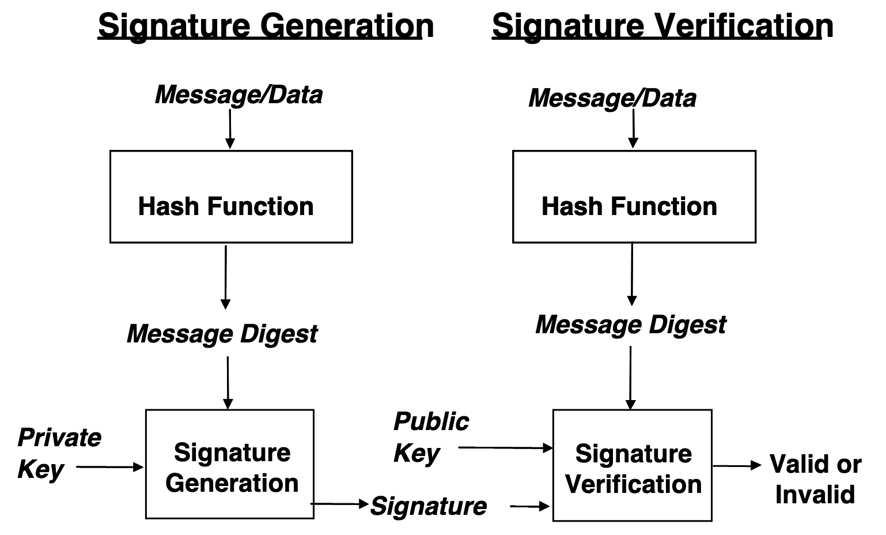

# Lecture 03 (Introduction to Cryptography)

## TLS

- TLS (Transport Layer Security) is a cryptographic protocol that provides secure communication over networks such as the Internet.

- It evolved from SSL (Secure Sockets Layer) and is used to ensure: Confidentiality, Integrity, Authentication. 

- TLS works by encrypting data transmitted between clients and servers to prevent eavesdropping or tampering.

- Without TLS:
    
    - Others can see your data (loss of privacy)..
    - Data can be altered in transit (loss of integrity).
    - You might not know who you’re communicating with (no authentication).
    - **Example:** A banking transaction without TLS could be intercepted or modified by an attacker.

- Where TLS Fits In

    - Operates on top of TCP.
    - Supports any application protocol (HTTP, SMTP, IMAP, etc.).
    - HTTPS (TLS) → Port 443
    - Provides secure communication by encrypting and validating data packets.

        

- TLS in Authentication

    - TLS supports client certificates for user authentication.

    - Eliminates need for passwords but adds certificate management complexity.

    - Can provide two-factor or mutual authentication (two-way SSL).

- TLS and Load Balancers

    - Load balancers can handle TLS termination (decrypt/encrypt).

    - Modes:

        1. SSL Bridging/Terminating: Load balancer decrypts traffic.

            

        2. SSL Tunneling/Pass-through: Traffic remains encrypted end-to-end.

            

    - Ensures session stickiness or session replication across servers.

## Protection at Two Levels

1. Lower Level (Channel Protection)

    - Focuses on securing the communication channel.
    
    - Ensures confidentiality and integrity of data during transmission.
    
    - Uses encryption and secure protocols.

    - Ex: TLS/SSL, VPNs, IPSec

2. Application/User Level

    - Works at the software and user interaction layer.

    - Focuses on authentication, access control, and data protection.

    - Prevents application-level attacks.

    - Ex: 
        - Multi-Factor Authentication (MFA)
        - Role-Based Access Control (RBAC)
        - Web Application Firewalls (WAF)
        - Secure database storage and encryption

## TLS Architecture

- Handshake Protocol

    

    1. Client Hello
        - The client sends a message to the server with: **Supported TLS versions**, **random key** (for generation).

    2. Server Hello
        - The server responds with: **server’s public key**, Chosen TLS version, **random key**
    
    3. Server Authentication: The client **verifies the server’s certificate** using the CA’s public key (to confirm identity).

    4. Key Exchange: The client and server use **public-key cryptography** (e.g., RSA or Diffie-Hellman) to **securely exchange a shared session key (secret key)**.

    5. Session Key Creation: Both sides independently **generate the same session key using their random numbers and the shared secret**.

    - Establishes a shared secret key between client and server using public key cryptography.

        

- TLS Security Mechanisms

    - Privacy: Encrypts messages using symmetric encryption (after handshake).

    - Key Exchange: Uses public key cryptography to exchange a session key. Common algorithms: RSA, Diffie-Hellman.

    - Integrity: Adds a Message Authentication Code (MAC) (e.g., SHA-1, MD5).

    - Authentication: Verifies identity via digital certificates (optional for client).

## Public Key Infrastructure (PKI)

- PKI helps verify the identity of entities communicating securely over a network.

- Uses public/private keys for encryption.

- Relies on trusted third parties, called Certificate Authorities (CAs).

- Large-Scale PKI Implementation

    1. HSM (Hardware Security Module)

        - Dedicated device for managing digital keys securely.

        - Provides tamper-proof and tamper-evident features.

        - Expensive but offers strong protection.
    
    2. Directory Server

        - Stores certificate-related data.

        - Used by CAs and OCSP responders.

        - Optimized for fast lookups (unlike databases).

- **Guarantees the authenticity of public keys through digital certificates.**

## How PGP works?

## Digital Certificates

- A digital certificate binds an entity’s identity to its public key.

- Certificate Creation Process:

    1. Generate a private key.
    2. Create a Certificate Signing Request (CSR).
    3. Send CSR to a CA.
    4. CA validates and issues a signed certificate.

- Examples of CAs: GoDaddy, Let’s Encrypt, Verizon.

- Self-Signed Certificates

    - Signed by the entity itself, not by a CA.
    - Common in testing or internal systems, but not trusted by browsers.
    - Example command-line tools: keytool, openssl.

- How digital signature generation and verification works?

    

## Attacks on SSL/TLS

- Man-in-the-Middle (MITM)

- Protocol Downgrade (forcing TLS 1.0/1.1)

    - **Hackers trick the system into using an older**, less secure TLS version (like TLS 1.0 or SSL 3.0) that’s easier to break.

- Heartbleed (OpenSSL memory leak)

    - A **bug in OpenSSL** that allowed attackers to **read private data** (like passwords and keys) directly **from a server’s memory**.

- BEAST / POODLE (CBC-related vulnerabilities)

    - Old vulnerabilities in the way encryption (CBC mode) was handled — **attackers could slowly guess and decrypt sensitive data like cookies**.

- Certificate Forgery / Compromised CA

## Mitigating TLS Risks

- Keep systems and libraries updated.

- Use the latest TLS version (1.3).

- Use strong cipher suites with large key sizes.

- Carefully assess legacy system compatibility.

- Document risks and mitigation steps.

## Real-World TLS Use Cases

- Websites: HTTPS for secure browsing.

- VPNs: SSL VPNs for encrypted tunnels.

- Email: SMTP, IMAP, POP3 over TLS.

- Messaging: XMPP, Matrix, WhatsApp, Signal.

- File Transfers: FTPS, SFTP, SMB over TLS.

- IoT: MQTT over TLS, CoAP over DTLS.

- Cloud Services: AWS, Google Cloud APIs.

- Remote Access: RDP and SSH with TLS.