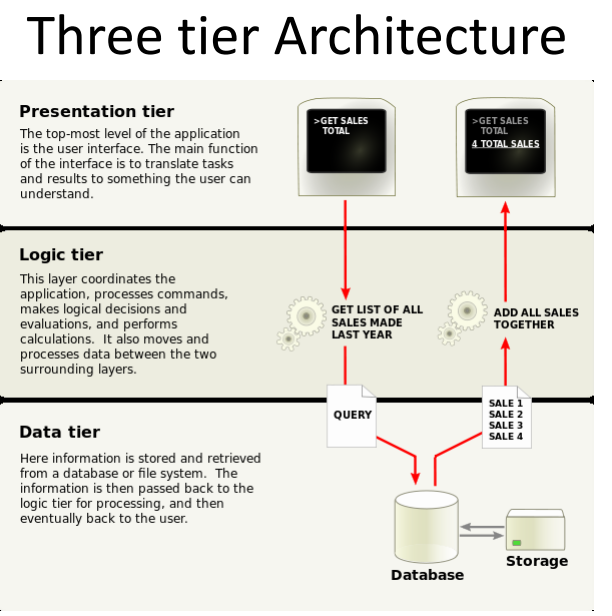
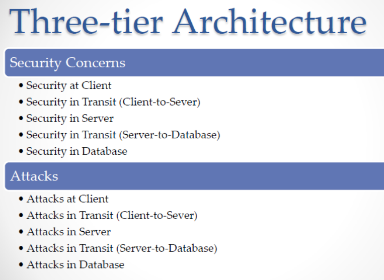
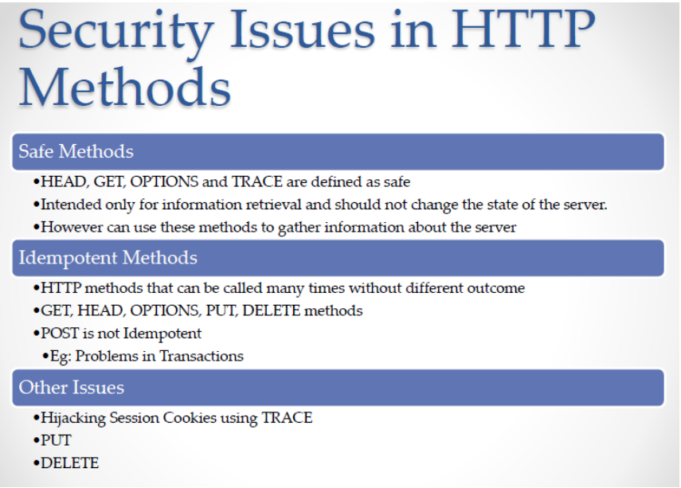
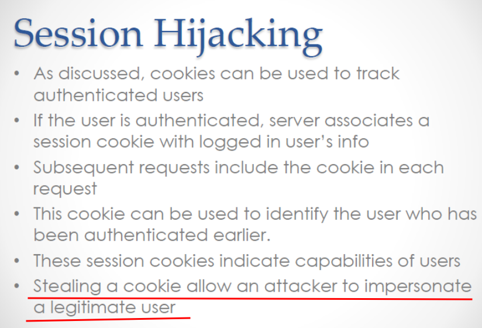
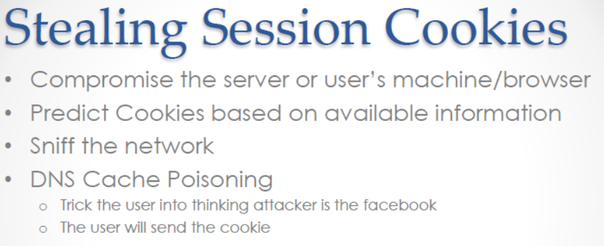
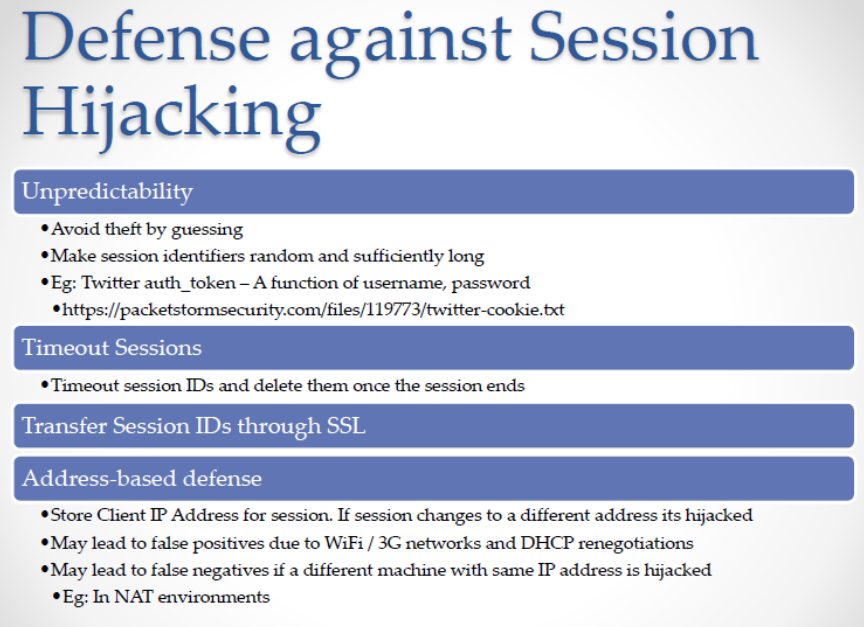

# Introduction to web security

## Three tier Architecture





## HTTP



## Cookies

- Cookies store data on the client-side to maintain sessions and preferences.

- Cookie Attributes

    - Name: Identifier for the cookie.

    - Content: Stored data (session ID, user token).

    - Domain: The website domain the cookie belongs to.

    - Path: Specifies where the cookie is valid.

    - Expiry: Defines when the cookie expires (optional).

- Types of Cookies

    - Persistent Cookie: Stored even after closing the browser (e.g., “Remember Me”).

    - Non-persistent (Session) Cookie: Deleted when the session ends.

    - HttpOnly: Not accessible via JavaScript → prevents XSS attacks.

    - Secure: Sent only over HTTPS connections.

- Cookie based attacks

    

    

    

## Cross site request forgery (CSRF)

- A type of attack where a malicious website tricks a logged-in user into performing unwanted actions on another site (like transferring money or changing passwords).

- It exploits existing sessions using the user’s valid cookies.

### Example

- Imagine you’re logged in to your bank in one browser tab.

- Then you visit a malicious site that sends a hidden request to your bank’s server like:

    ```
    <form action="https://mybank.com/transfer" method="POST">
    <input type="hidden" name="amount" value="5000">
    <input type="hidden" name="to" value="attacker123">
    </form>
    <script>document.forms[0].submit();</script>
    ```

- Your browser will send your session cookie, and the server will treat it as a valid request.

### Preventing CSRF Attacks

- Use CSRF Tokens (Synchronizer Token Pattern): Tokens are random values generated by the server and embedded in forms or requests to verify the source.

- Double submit cookies

    - The token is sent in both a cookie and a form field/header.

    - The server checks if both values match.

    - Prevents CSRF without requiring server-side storage.

- Remove/Don’t use default session cookies

- Follow OWASP Guidelines


## Cross site scripting (XSS)

- XSS Prevention

    - Input validation
    - Output sanitization

- XSS Types

    1. Reflective XSS: The malicious script is reflected off the server immediately (e.g., through a URL parameter).

    2. Stored/Persistent XSS: The script is permanently stored on the server (e.g., in a database or comment field) and executes whenever a user visits the page.

- What XSS Can do?

    - Session hijacking
    - Site defacement
    - Site redirection/Phishing
    - Data theft
    - Keystroke Logging

- XSS vulnerability detection tools

    - Most dynamic scanning tools (DAST) can detect pages with XSS vulnerability
    - OWASP zed attack proxy
    - Burp Suite
    - There can be false positives/false negatives

## SQL Injections

- Injection flaws in SQL can be due to flaws in SQL, LDAP, or OS injection vulnerabilities

- SQL Injection can happen in:
    - GET Requets
    - POST Requets

- Impact of SQL Injection

    - Login bypass (gain unauthorized access).
    - Data theft (extract confidential data).
    - Database destruction (drop tables/databases).
    - Privilege escalation (gain admin rights).


| Type              | Description                                                                     |
| ----------------- | ------------------------------------------------------------------------------- |
| **Boolean-Based** | Uses true/false conditions to infer data.                                       |
| **Union-Based**   | Combines results from multiple queries (requires matching column counts/types). |
| **Error-Based**   | Exploits database error messages to extract information.                        |
| **Time-Based**    | Uses deliberate delays (`SLEEP()` function) to test injection success silently. |


- Preventing SQL Injection

    - Sanitization of User Input
        - Client-side sanitization (JavaScript) can be bypassed easily.
        - **Always sanitize on the server side.**
    

    - Use parameterized Queries (Prepared Statements)

        - This is the most effective method to prevent SQL injection.

        - Example in PHP

            ```
            $stmt = $pdo->prepare("SELECT * FROM users WHERE username = ? AND password = ?");
            $stmt->execute([$username, $password]);
            ```
    
    - Principle of Least Privilege

        - Give the database user minimum privileges (DML only — SELECT, INSERT, UPDATE).

        - Avoid using a root/admin account for web apps.

    - Search for SQL Injections vuln sites

        - inurl:.php?id=

## Sanitization Methods
| Method           | Description                                             | Issues                                                                 |
| ---------------- | ------------------------------------------------------- | ---------------------------------------------------------------------- |
| **Blacklisting** | Remove known dangerous characters (`'`, `;`, `--`)      | Can break valid input like names (`O’Connor`)                          |
| **Escaping**     | Add escape characters before special symbols (`' → \'`) | Built-in functions like `mysql_real_escape_string()` or `PDO::quote()` |
| **Whitelisting** | Accept only known safe inputs                           | Most secure method, but restrictive                                    |
