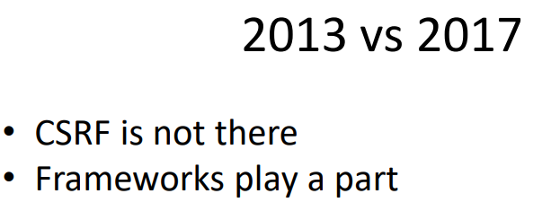

# Web Security – OWASP Top 10



## 1. Security Misconfiguration

- Happens when servers, databases, or frameworks are **not securely configured**.
- **Examples:**

    - Default admin credentials.
    - Exposed error messages.
    - Unused services or open ports.
    - Misconfigured SSL certificates.

- **Mitigation:**

    - Change default credentials and ports.
    - Disable unnecessary features.
    - Regularly patch and harden configurations.


## 2. Insecure direct object reference

- Occurs when internal objects (user IDs, file paths) are exposed without authorization.

- Example:

    ```
    From: https://example.com/profile?user=1001

    To: https://example.com/profile?user=1002
    ```
## 3. Insufficient Logging and Monitoring
- The system fails to detect or alert on suspicious activities.

- **Impact:** Attackers can act for long periods unnoticed.

- **Mitigation:**
    - Centralize and monitor logs.
    - Implement intrusion detection systems (IDS).
    - Track failed logins and privilege changes.

## 4. Unvalidated Redirects and Forwards

- User-controlled input is used in redirects.

- Ex: Redirects users to a phishing site.

- **Mitigation:**
    - Validate and whitelist redirect URLs.
    - Avoid using untrusted user input in redirects.

## 5. Missing Function-Level Access Control
- APIs or functions are accessible without proper role checks.

- **Example:** `/admin/deleteUser` accessible by a normal user.

- **Mitigation:**
    - Verify authorization for every server-side request.
    - Implement role-based access control (RBAC).

## 6. Insecure Deserialization
- Occurs when untrusted or modified data is deserialized, possibly leading to **remote code execution (RCE)**.

- **Example:** Attacker sends a malicious serialized object that executes code.

- **Mitigation:**
    - Avoid deserializing untrusted data.
    - Use integrity checks or signatures.
    - Employ safe data formats (e.g., JSON).

## 7. XML External Entities (XXE)
- Vulnerability in XML parsers that allows reading of local files or SSRF attacks.

- **Example:** “Billion Laughs” XML bomb.

- **Mitigation:**
    - Disable external entities in XML parsers.
    - Prefer JSON over XML.
    - Follow secure coding standards (e.g., WSO2 Secure Engineering Guidelines).

## 8. Using Components with Known Vulnerabilities
- Applications depend on third-party libraries with security flaws.

- **Examples:** Outdated frameworks or OpenSSL (Heartbleed).

- **Mitigation:**
    - Regularly update dependencies.
    - Use dependency scanning tools (OWASP Dependency Check, Snyk).
    - Maintain a **Software Bill of Materials (SBOM)**.

---

## Static Code Analysis
- Scans source code to find vulnerabilities before runtime.
- **Tools:** Veracode, SourceClear, FindBugs.
- **Benefits:**
- Detect insecure APIs, hardcoded credentials, or missing validation.
- Integrate into CI/CD pipelines (DevSecOps).

## Responsible Vulnerability Disclosure
- The ethical process of reporting security issues to organizations before public disclosure.

- **Steps:**
    1. Identify and document the issue.
    2. Report privately to the vendor.
    3. Wait for a buffer period for patch release.
    4. Publish as a **security advisory**.

- **Encouraged via:** Bug bounty programs.


## Secure Software Development Lifecycle (S-SDLC)

Security must be integrated from the start of the development process.

**Key Practices:**
1. **Static Code Analysis** – detect vulnerabilities before release.  
2. **Dynamic Application Testing** – test for real-world attack behavior.  
3. **Dependency Scanning** – monitor for vulnerable libraries.  
4. **Automation (DevSecOps)** – use CI/CD tools like Jenkins, GitHub Actions.  
5. **Security Reviews** – have dedicated teams review code and architecture.  
6. **Developer Training** – ensure awareness of OWASP and secure coding.  
7. **Security Guidelines** – follow frameworks like *WSO2 Secure Engineering*.