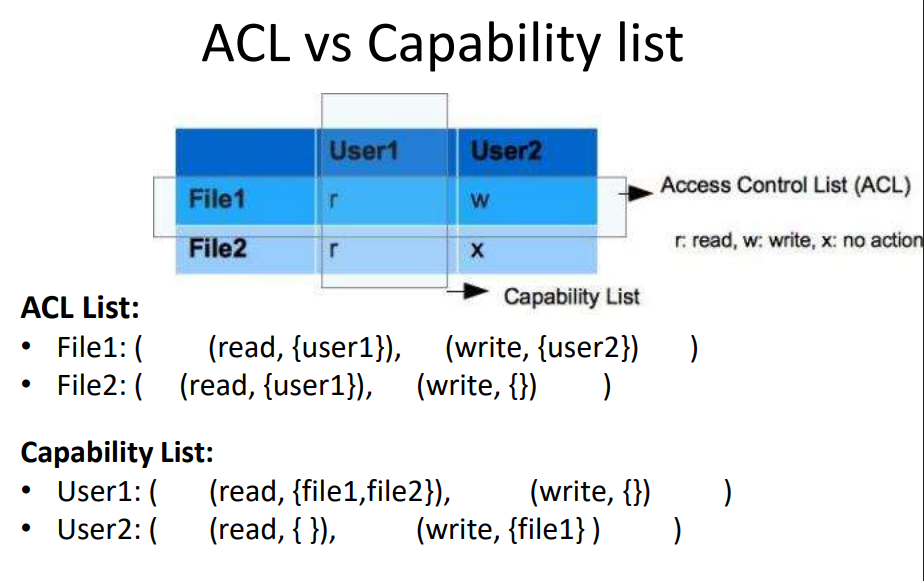

# Authorization

## What is Authorization/Access Control

-   Mechanism using with a system grants permission to access/modify some data or perform some action.

## Categorization by Implementation

1. Logical Controls

2. Administrative Controls

3. Physical Controls

## Categorization by time continuum

1. Directive Controls: Designed to establish desired outcomes

2. Deterrent controls: Designed to discourage
   an attacker

3. Preventive controls: Designed to prevent an
   attack from happening

4. Compensating controls: Designed to
   compensate for a risk that’s too difficult to
   address

5. Detective controls: Designed to detect an
   attack while it is happening

6. Corrective controls: Designed to mitigate the
   damage once an attack/intrusion has taken
   place

7. Recovery controls: Designed to bring back a
   system to its normal operational state

## Categorization by Enforcement

1. Discretionary Access Controls (DAC): Owner of the data determine privileges

2. Mandatory Access Controls (MAC): Defined by System or as per Organizational Security Policy

3. Non-Discretionary Access Controls: Defined by the Administrator

## Data Access Control Methods

-   ACL

-   Access Control Matrix: Same thing as ACL in a form of table

-   Rule based Access Control: Access Control based on rules

-   Role based Access Control: Access Control based on user role

-   Content Dependent Access Control: Based on actual content rather than role. Can be used in environments when roles change frequently.

-   Constrained User Interface: Limit functions user have access to.

-   Capability Tables: Match Subjects with their capabilities

-   Temporal (Time-Based) Isolation: Constrain access on Time

## OAuth

### Auth Code Grant type

-   Client –> Server side web app (redirection url)

-   Client - > Auth server → backchannel call

-   Auth server remembers the consents

-   Request params (refer the spec)

-   Register client app (developer portal)

-   Facebook apps

### IAM Patterns

### Implicit grant type

-   Client –> Single page Javascript app

-   User can see the token (so better to have a lesser validity period)

### Password credentials grant type

-   User’s credentials are passed

-   Client has to be trusted

### Client credentials grant type

-   Not relevant for sharing user details

-   About sharing a shared resource in a trusted manner (with authorization)

### Refresh Tokens

-   Supported only in auth code and password grant types

### Oauth Use cases

e.g. upload files to Google drive – Auth code

e.g. Google map api – client credentials

### Token introspection

-   Defines the token validation process bw the resource server and auth server

-   Token introspection endpoint in AuthServer

-   Timestamp skew

### Token revocation

-   Client requests the Auth Server to revoke a token if there’s a breach

-   Auth Server – Revocation endpoint

### Dynamic client registration

-   To automate the client registration process
